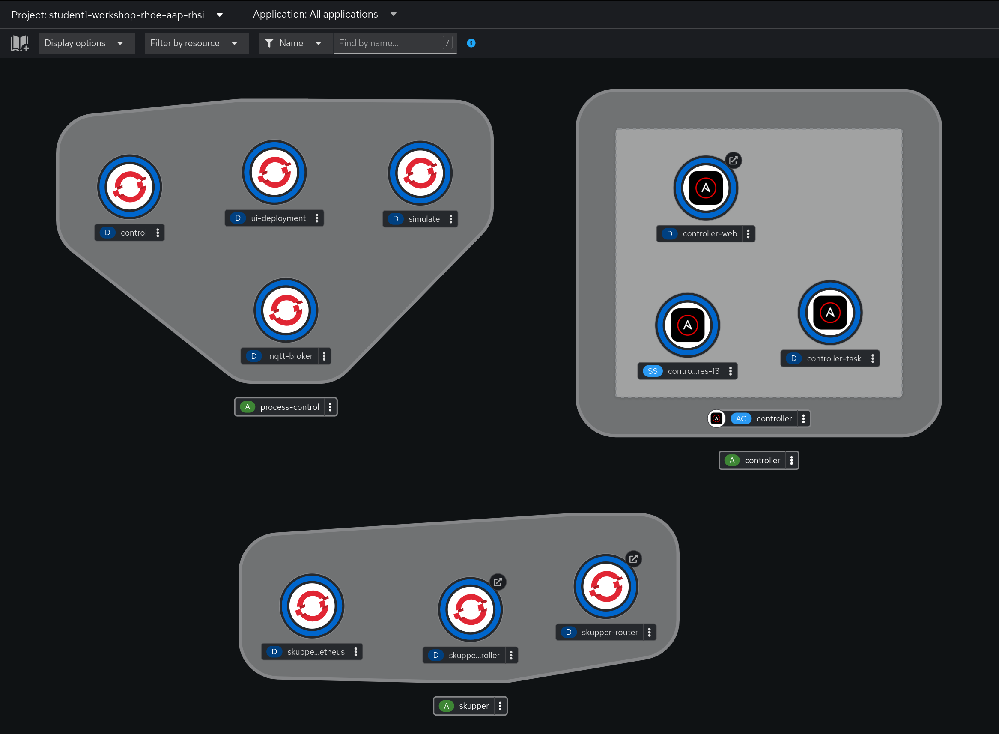
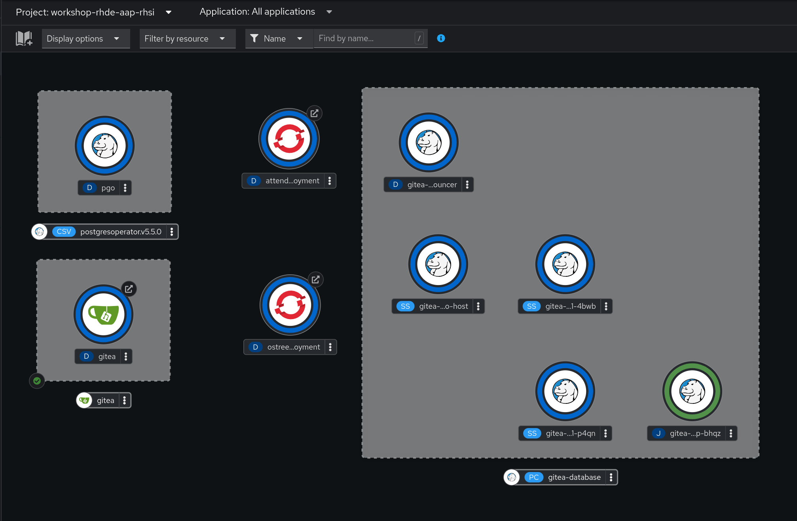

# Workshop Exercise 1.1 - Preflight and Introduction

## Table of Contents

* [Objective](#objective)
* [Guide](#guide)
   * [Your Lab Environment](#your-lab-environment)
   * [Step 1 - Identifying Edge Device Type](#step-1---identifying-edge-device-type)

## Objective

* Understand the lab topology, provided hardware (if applicable), and how to access virtual instances (again, if applicable).
* Understand how to use the workshop exercises.

These first few lab exercises will be exploring the lab and gathering baseline information for use in later excercises.

## Guide

### Your Lab Environment

This lab makes use of many different services: some dedicated to you, some shared. Later steps will walk through accessing these services. In addition, links to the services are available on your student page.

#### Dedicated Services

| Service | Purpose |
| --- | --- |
| Ansible Controller | Automation controller for running Ansible automation |
| Process Control Application | Example application to be deployed to edge devices |
| RHSI (Skupper) | Service Interconnect (Skupper) deployment with router and console |

#### Shared Services

| Service | Purpose |
| --- | --- |
| Gitea Source Control | SCM with a webUI for code storage |
| Student Pages | Web pages containing information and links |
| OS-tree Repo | ostree repository containing files for provisioning devices |

There are additional services deployed for building images, device provisioning, etc, however these will not be interacted with directly in this workshop.

### Completing the Exercises

This entire workshop can be run from a web browser. SSH will be used for some exercies, however the terminal section of cockpit will give you a web-based way to interact with a shell. Accessing this is covered in a later section.

Optionally, feel free to use SSH and an IDE on your personal device.

> **Note**
>
> If you need more information on new Ansible Automation Platform components, bookmark this landing page [https://red.ht/AAP-20](https://red.ht/AAP-20)

---
**Navigation**

[Next Exercise](../1.2-device-intro/)

[Click here to return to the Workshop Homepage](../README.md)
