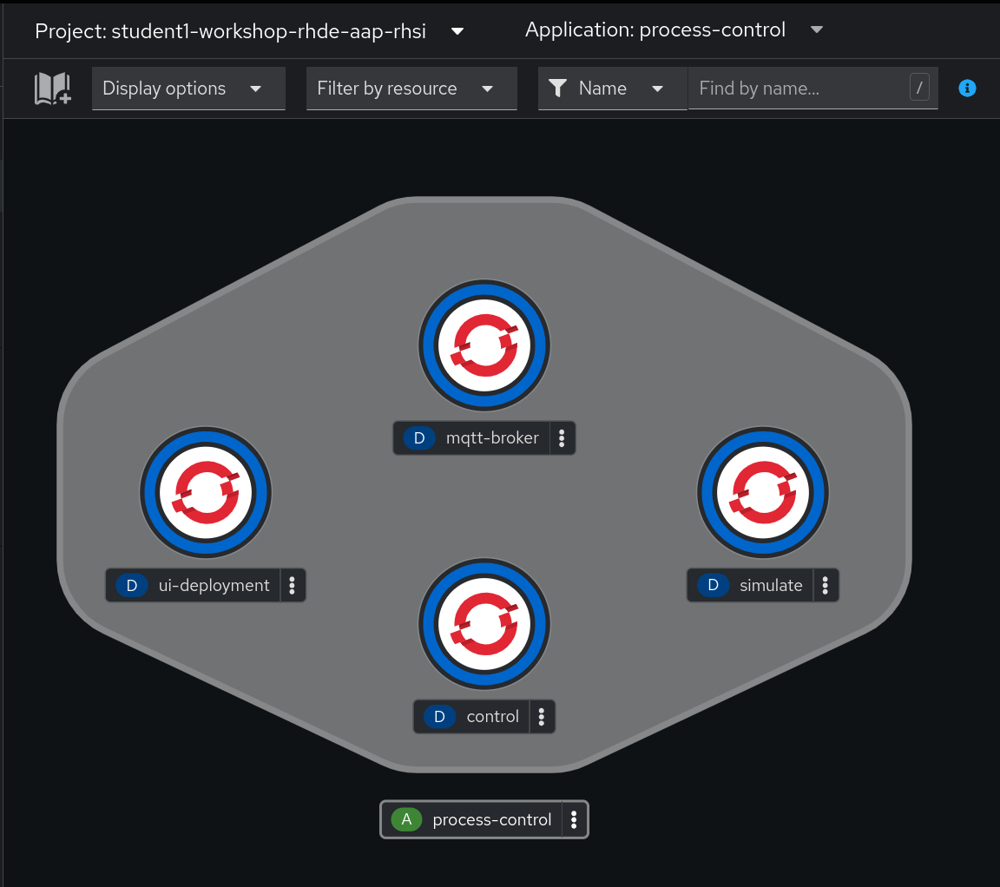

# Workshop Exercise 1.4 - Investigating the Example Workload

## Table of Contents

* [Objective](#objective)
* [Step 1 - Introduction to the Workload](#step-1---introduction-to-the-workload)
* [Step 2 - The MQTT Broker](#step-2---the-mqtt-broker)
* [Step 3 - The Simulator](#step-3---the-simulator)
* [Step 4 - The Controller](#step-4---the-controller)
* [Step 5 - The WebUI](#step-5---the-webui)
* [Step 6 - The Assembled Application](#step-6---the-assembled-application)


## Objective

In this exercise, we are going to investigate the workload we'll be deploying to our edge devices. Podman will be used to run the workload on the edge devices, however it can also run on top of MicroShift and OpenShift.

This exercise will cover:

* The components of the application and their functions
* The required communication between the components

### Step 1 - Introduction to the Workload

For our workshop, we'll be running a brew kettle simulator comprised of four components:

1. A lightweight MQTT broker - we'll be using [Eclipse Mosquitto](https://mosquitto.org/)
2. A simulator for the tank, heater, and temperature sensor
3. A controller that relays information between the simulator and the WebUI
4. A WebUI that can control temperature and graphs information


For reference, the workload has been deployed into your namespace on OpenShift:


It can be accessed externally via the URL listed in your student page.

Accessing the OpenShift WebUI will be covered in a later exercise

A big thank you to [Rockwell Automation's](https://www.rockwellautomation.com/) Advanced Technologies group for allowing us to leverage this application.

### Step 2 - The MQTT Broker

We'll be using a lightweight MQTT broker to pass messages between the other components of the application.

For ease of use, we'll be setting the broker to listen on port `1883` and allow anonymous publishing of messages:

```
listener 1883
allow_anonymous true
```

In a production setting these would not be acceptable, as anyone on the network could publish messages to the broker. However, throughout the lab, we'll leverage a few different methods to control access to the broker, such as firewalld rules, running it inside of a pod with no mapping to host ports, etc.

### Step 3 - The Simulator

This brew process simulation includes a tank with a temperature sensor and heater. It is responsible for the following:

- The simulation communicates via MQTT topics with the controller and visualization components.
- The simulation, MQTT broker, control and visualization components are independent services.


This component will need to communicate with other parts of the application, but does not need to be accessed directly.

### Step 4 - The Controller

This component takes input from the WebUI as well as information from the simulator and determines how much energy should be added or optionally, should the heater even be on.

This control function is wired up as such:


### Step 5 - The WebUI

Finally, this component provides a web interface, allowing for the interaction with the simulated system. The wiring is as such:


### Step 6 - The Assembled Application

Should all components of the application be functioning and communicating, visiting the web interface should present an interface where the setpoint of the tank can be adjusted up or down, and a few metrics will be displated as the controller attempts to bring the system to the sedired set point:


---
**Navigation**

[Previous Excercise](../1.3-edge-device-intro/) | [Next Exercise](../1.5-controller-intro/)

[Click here to return to the Workshop Homepage](../README.md)
