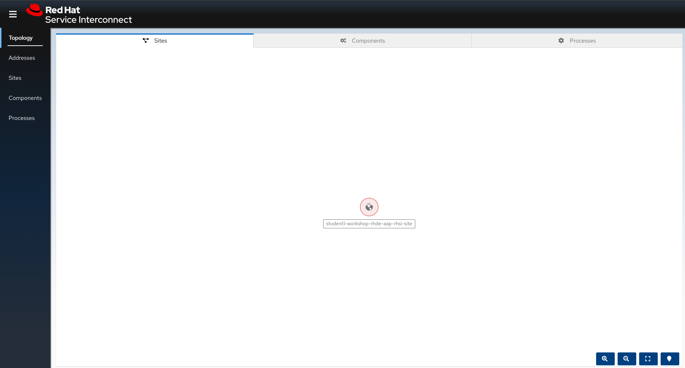

# Workshop Exercise 1.8 - Investigating the RHSI Site

## Table of Contents

* [Objective](#objective)
* [Step 1 - Authenticating to the Cluster](#step-1---reviewing-the-code-repo-location)
* [Step 2 - Investigating the Console](#step-2---cloning-your-code-repo)

## Objective

In this exercise, we're going to access the Red Hat Serice Interconnect web console, and ensure familiarity with some key terms and ideas.

### Step 1 - Introduction to RHSI

RHSI is a layer 7 service interconnect that allows for connections to be made without special configruation, unlike a VPN. Since we're operating at layer 7, our traffic will look similar to any other web traffic, such as visiting a website. This means we can traverse networks that don't allow for things like port-forwarding or static NAT without issue.

In this workshop, our edge devices will be what originate the collection, traversing whatever network is between them and our cluster. In the same way your laptop or phone is accessing this web page, our edge devices will make a connection back to our cluster in AWS and allow us to expose services for consumption.

> Note:
> 
> The upstream of RHSI is [Skupper](https://skupper.io). Not everything in RHSI has been renamed from the upstream.

### Step 2 - Accessing the RHSI Dashboard

Red Hat Service Interconnect comes with a web interface that can be used to visualize topologies and provide information about what services are being exposed.

The link to the dashboard can be found on your student page. Authentication should be handled automatically, but if not, use the same credentials used to log in to the OpenShift console.

The default tab is the sites tab, where we should see only one site which was pre-configured for us during the provisioning of this workshop.

The other tabs contain similiar information to the developer view in the OpenShift console, allowing drill-down into our deployed applications. Feel free to click around in the web interface and familiarize yourself with the various tabs and menus.

> Note:
>
> Unlike the developer dashboard, this web interface filters out the underlying RHSI infrastructure, instead only showing the example process control application and the deployment of Ansible Controller.

---
**Navigation**

[Previous Exercise](../1.8-login-to-ocp/) | [Next Exercise](../2.1-oc-auth/)

[Click here to return to the Workshop Homepage](../README.md)
