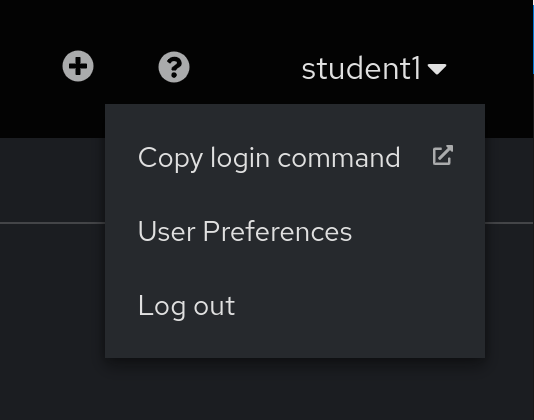

# Workshop Exercise 2.1 - Authenticating on our Edge Device

## Table of Contents

* [Objective](#objective)
* [Step 1 - Retrieving our Authentication Token](#step-1---retreving-our-authorization-token)
* [Step 2 - Logging in from the CLI](#step-2---authenticating-from-our-edge-device)

## Objective

In this exercise, we're going to retrieve our authentication token and use it to authorize on our edge device.

RHSI will use the authentication information stored locally by the `oc` command, so running these steps will allow us to connect up RHSI in the next exercises.

### Step 1 - Retreving our Authorization Token

To grab our token, access the OpenShift web console. In the top right corner, a dropdown menu will have an option called `Copy login command`, which will open another page. Select this option.

> Note:
>
> If you are prompted for a username and password, use the same credentials as the OpenShift console.

This new page will display our token, and allow us to copy the login command directly from the top box. This tab can be left open for the next step.

> Note:
>
> This is an example token, not a real one.

### Step 2 - Authenticating from our Edge Device

> Note:
>
> You can access the virtual device also from the Terminal menu inside Cockpit
> 
> The username to access the virtual device is `ansible` and the password is the one of the student user
> 
> Once inside the terminal view you can copy and paste with SHIFT + INSERT

The `openshift-clients` package has been installed on our edge devices as part of the RHDE image, providing us with access to the `oc` command. As such, we can paste the `oc login` command from the previous step directly on the command line:

If successful, the welcome message should be displayed.

---
**Navigation**

[Previous Exercise](../1.9-rhsi-intro/) | [Next Exercise](../2.2-setup-for-rhsi/)

[Click here to return to the Workshop Homepage](../README.md)
