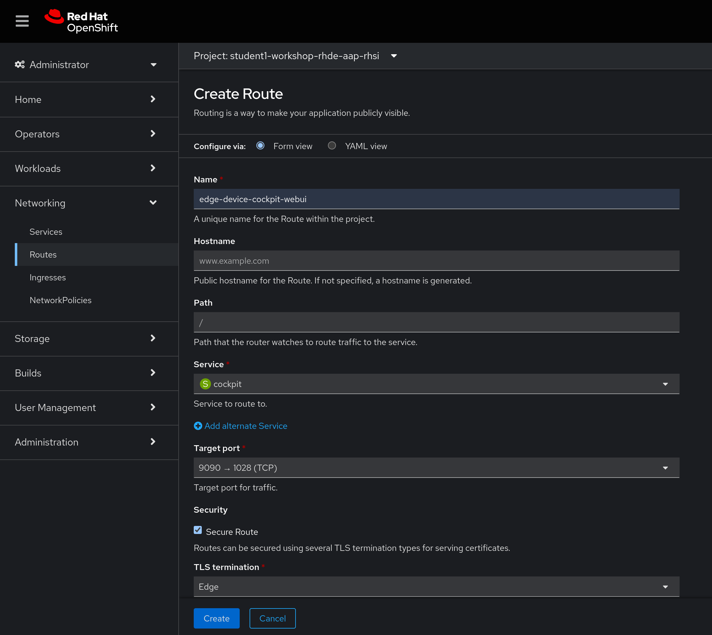

# Workshop Exercise 2.4 - Exposing SSH and Cockpit WebUI via RHSI

## Table of Contents

* [Objective](#objective)
* [Step 1 - Exposing SSH](#step-1---reviewing-the-code-repo-location)
* [Step 2 - Exposing the Cockpit WebUI](#step-2---cloning-your-code-repo)
* [Step 3 - Create Route for Cockpit WebUI](#step-2---cloning-your-code-repo)

## Objective

In this exercise, we're going to expose some services on the edge device back into our namespace on the OpenShift cluster in AWS. This will allow applications to start communicating with the services on the edge device as if they were deployed on the cluster itself.

For our setup, we'll expose SSH to our namespace, but not allow external access to it, granting some level of protection. However, we will create an external route for the Cockpit web service on our edge devices.

> Note:
>
> Generally speaking, it is not recommended to deploy Cockpit to edge devices, however it can be useful for evalutions of RHDE, and for getting non-Linux individuals accustomed to RHDE.

### Step 1 - Exposing SSH

Similar to creating services within Kubernetes, we'll create a service for SSH on our edge device via the RHSI CLI tooling, and then bind it.

First, we'll create a service: `skupper service create ssh 22`. Then, we'll tell the gateway to bind the service: `skupper gateway bind ssh localhost 22`.


A few notes here:
1. We've named the service `ssh` for convenience.
2. Skupper assumes the protocol is tcp, however http(s) are also options.
3. We specified `localhost` as the destination address for binding the service, however it is possible to have the edge device reach out externally. This would be a way to securely access systems on the same network (or just generally "in reach") of the edge device, but not of the OpenShift cluster.

We can confirm the service was exposed both in the RHSI web console, and under the `services` tab of the OpenShift web console Administrator view:


### Step 2 - Optional - Exposing the Cockpit WebUI

In the same fashion, we'll expose the Cockpit WebUI from our edge device:
```
skupper service create cockpit 9090
skupper gateway bind cockpit localhost 9090
```


Again, we'll confirm in the various web consoles:


### Step 3 - Optional - Creating a Route for the Cockpit WebUI

Since we now have a service in our OpenShift cluster, we can create a route for external access to the service, exactly like creating a route for any other service.

In the Openshift web console, on the Administrator view, access the Networking > Routes page, and click `Create Route` in the top right corner.

Enter the following information, adjusting accordingly:



Or, in yaml:
```yaml
kind: Route
apiVersion: route.openshift.io/v1
metadata:
  name: edge-device-cockpit-webui
  namespace: student1-workshop-rhde-aap-rhsi
spec:
  host: >-
    edge-device-cockpit-webui-student1-workshop-rhde-aap-rhsi.apps.rho.apac.redhat-workshops.com
  to:
    kind: Service
    name: cockpit
    weight: 100
  port:
    targetPort: port9090
  tls:
    termination: edge
  wildcardPolicy: None
```

> Note:
>
> This is an example, adjust accordingly based off information in your student page.

### Step 4 - Optional - Customizing Cockpit Allowed Origins

Cockpit leverages web sockets for connectivity, and while OpenShift can handle these natively, we need to tell Cockpit to allow the domain we're connecting from. This corresponds to the URL provided by our route.

Copy the route from the OpenShift web console, and n the edge device, create the file `/etc/cockpit/cockpit.conf` and insert the following, adjusted accordingly. For example, if the route shows:


Then the configuration file would be:

```
[WebService]
Origins = https://edge-device-cockpit-webui-student1-workshop-rhde-aap-rhsi.apps.rho.apac.redhat-workshops.com
ProtocolHeader = X-Forwarded-Proto
```

Then, restart the cockpit service: `sudo systemctl restart cockpit.service`

> Note:
>
> These need to be run with `sudo`.

The cockpit web interface should now work:


---
**Navigation**

[Previous Exercise](../2.1-ocp-auth/) | [Next Exercise](../2.3-link-rhsi/)

[Click here to return to the Workshop Homepage](../README.md)
